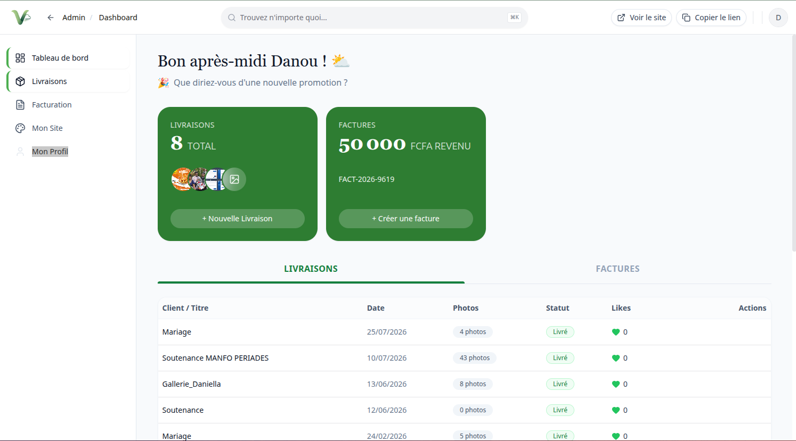
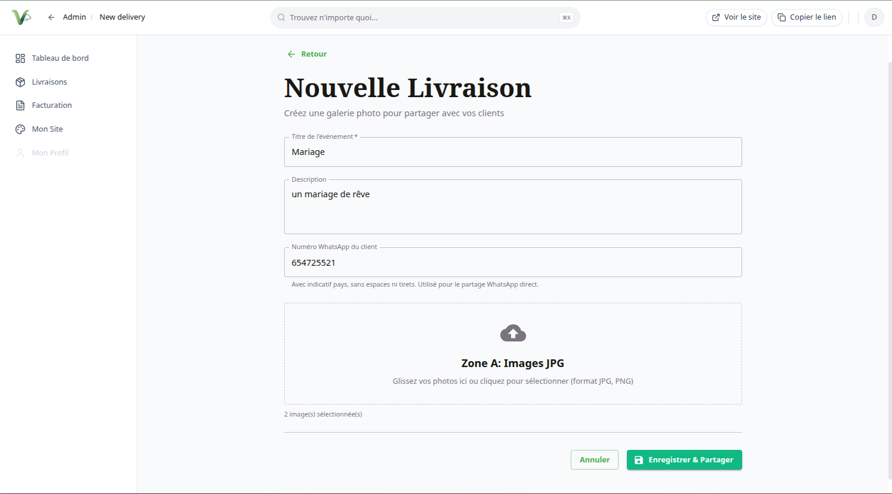
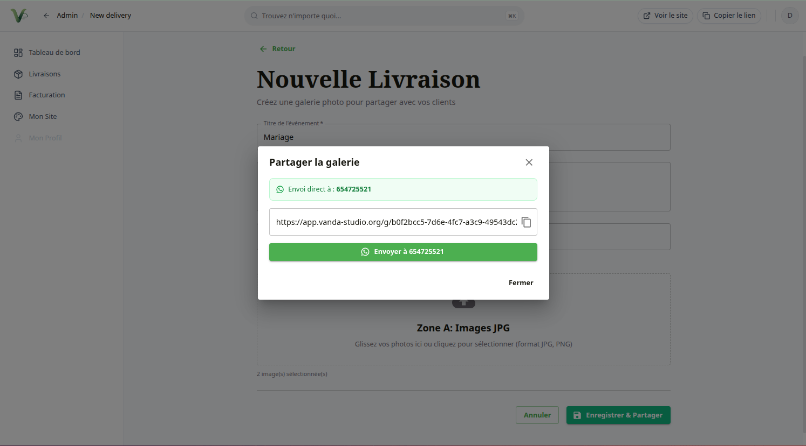
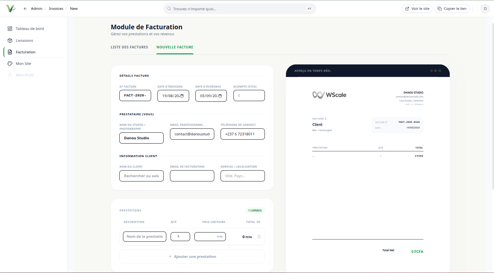
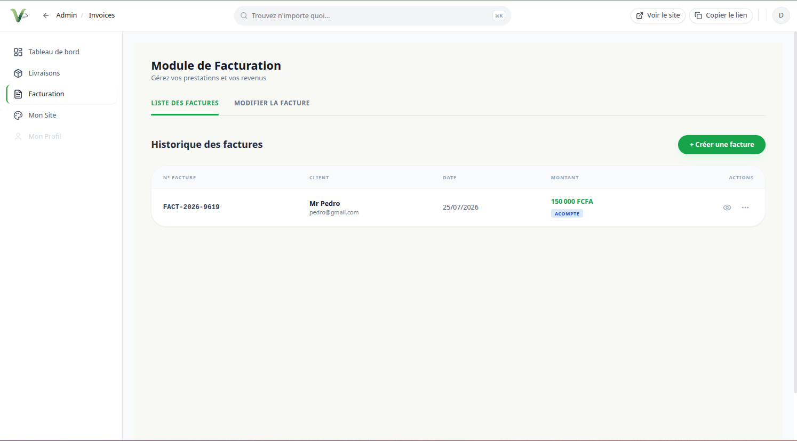
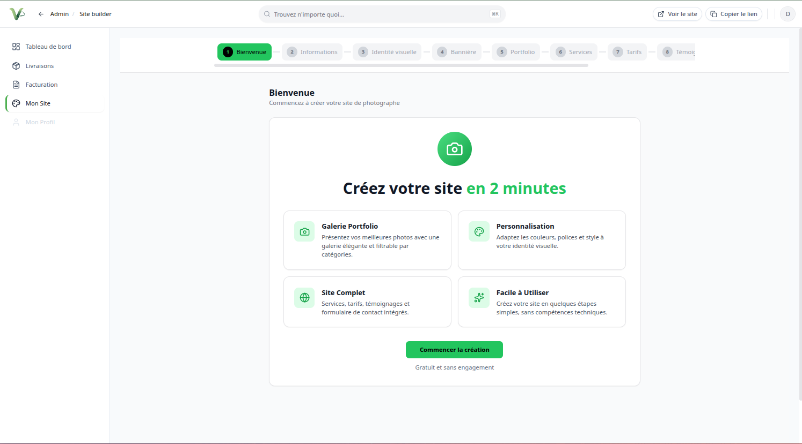
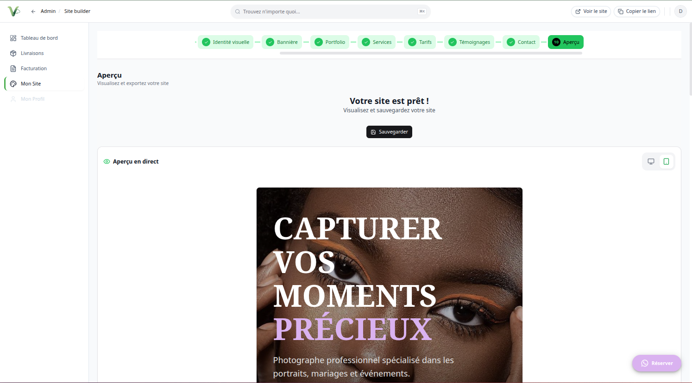

<p align="center">
  
</p>

<h1 align="center">VANDA STUDIO</h1>

<p align="center">
  <strong>La plateforme SaaS qui permet à chaque créatif (photographe, graphiste, vidéaste...) de créer, gérer et monétiser son propre studio en ligne.</strong>
</p>

<p align="center">
  <a href="https://vanda-studio.org">Live Product</a> ·
  <a href="https://github.com/Songnia">Portfolio / Case Study</a>
</p>

<p align="center">
  
  
  
  
  
  
</p>

---

## Sommaire

- [Présentation](#présentation)
- [Problème](#problème)
- [Fonctionnalités](#fonctionnalités)
- [Mon rôle](#mon-rôle)
- [Architecture](#architecture)
- [Stack technique](#stack-technique)
- [Défis techniques](#défis-techniques)
- [Captures d'écran](#captures-décran)
- [Démarrage rapide](#démarrage-rapide)
- [Tests](#tests)
- [Déploiement](#déploiement)
- [Sécurité](#sécurité)
- [Statut](#statut)
- [Licence](#licence)
- [Auteur](#auteur)

---

## Présentation

**VANDA STUDIO** est une plateforme SaaS destinée aux créatifs indépendants. Chaque professionnel dispose de son propre espace pour :

- gérer ses **galeries photos** et livrer ses livrables à ses clients (avec protection par code PIN) ;
- facturer ses clients (devis, factures, export PDF, partage par lien) ;
- créer son **site vitrine** via un builder guidé sans code (10 étapes) ;
- monétiser ses services via des **abonnements et paiements en ligne** (Mobile Money FCFA via Maketou) ;
- être découvert via une **infrastructure SEO programmatique** (landing pages métiers, guides, alternatives).

Trois expériences distinctes sont servies depuis un monorepo unique :

| Expérience | URL | Description |
| :--- | :--- | :--- |
| **Site public** | `vanda-studio.org` | Vitrine de la plateforme + inscription des créatifs. |
| **Application** | `app.vanda-studio.org` | Espace créatif : galeries, factures, builder de site, abonnements. |
| **API** | `api.vanda-studio.org` | API REST (Laravel + Sanctum) alimentant les deux applications. |

---

## Problème

Les photographes et créatifs indépendants en Afrique francophone ne disposent pas d'une solution simple et accessible pour :

1. **numériser leur activité** — livraison de photos, devis et factures restent faits manuellement (WhatsApp, papier) ;
2. **être visibles en ligne** — créer un site vitrine professionnel nécessite des compétences techniques ou des budgets élevés ;
3. **se faire payer en ligne** — les solutions internationales (Stripe, PayPal) ne couvrent pas le **Mobile Money FCFA** (Orange Money, MTN MoMo) largement utilisé dans la région.

VANDA STUDIO répond à ces trois problèmes dans une seule plateforme, en langue française et adaptée au marché local.

---

## Fonctionnalités

### Côté créatif (application admin)
- **Gestion des galeries** — création, upload par lots, photos privées/protégées par code PIN, partage de livraison client.
- **Facturation** — génération de devis et factures, suivi des paiements, export PDF, partage par lien.
- **Builder de site** — création guidée (10 étapes) du site vitrine : identité visuelle, hero, portfolio, services, tarifs, témoignages, contact, puis publication en un clic.
- **Souscription & paiement** — plans d'abonnement, abonnement actif, paiement en ligne via **Maketou** (Mobile Money FCFA).

### Côté client
- **Galerie client** — consultation des photos livrées, téléchargement après identification (PIN), likes.

### Côté administrateur (super-admin)
- **Tableau de bord** — vue d'ensemble de la plateforme (utilisateurs, transactions).
- **Gestion des créatifs** — activation/désactivation des comptes, publication des sites.
- **Gestion des plans d'abonnement** — création, modification, tarification.

### SEO programmatique
- **Pages marketing SSR** (Laravel Blade) : `/for/{métier}`, `/tools/{slug}`, `/features/{slug}`, `/solutions/{slug}`, `/alternatives`, guides et tarifs.
- **Sitemaps dynamiques** (`sitemap.xml`, `sitemap-{group}.xml`) et `robots.txt` générés.
- **Pages SEO côté SPA** (React) pour les templates internes.

---

## Mon rôle

Développement complet du produit par **Songnia Wilfried Tresor** :

- **Product Engineering** — conception produit, modélisation métier, UX/UI, itérations avec les utilisateurs.
- **Full-Stack** — API Laravel (auth, galeries, factures, abonnements, paiements, multi-tenant), frontend React (site public, application admin, builder, template généré).
- **Sécurité** — durcissement de l'authentification (activation des comptes, middleware), validation stricte des uploads (ZIP, images), isolation multi-tenant, secrets gérés via variables d'environnement.
- **DevOps** — CI/CD GitHub Actions (tests + builds automatiques), déploiement automatisé sur serveur mutualisé O2switch, infrastructure SEO.

---

## Architecture

Monorepo à **deux composants** :

- **`backend/`** — API REST Laravel 12 (PHP 8.3, MySQL, Sanctum, Spatie Media Library, intégration de paiement Maketou). Sert aussi les builds statiques du frontend et les pages SEO SSR.
- **`frontend/`** — Applications React 19 + TypeScript + Vite, construites en **deux bundles** (public et admin) et packagées en PWA (VitePWA).

Le frontend utilise **Vite en mode conditionnel** : la variable `VITE_APP_MODE` (public ou admin) détermine le point d'entrée (`index-public.html` ou `index-admin.html`) et le répertoire de sortie (`dist-public` ou `dist-admin`).

```
┌─────────────────────────────┐      ┌──────────────────────────────┐
│  vanda-studio.org           │      │  app.vanda-studio.org        │
│  (React, dist-public)       │      │  (React, dist-admin + PWA)   │
└─────────────┬───────────────┘      └──────────────┬───────────────┘
              │  HTTPS / REST + Sanctum             │
              └────────────────────┬────────────────┘
                                   ▼
                       ┌──────────────────────┐
                       │  api.vanda-studio.org│
                       │  Laravel 12 + MySQL  │
                       │  + Maketou payments  │
                       └──────────────────────┘
```

---

## Stack technique

### Frontend
- **React 19** + **TypeScript 5** + **Vite 7**
- **MUI (Material UI)**, Tailwind CSS, Radix UI
- React Router 7, React Hook Form, Zod, i18next (FR/EN)
- PWA : vite-plugin-pwa (Workbox)

### Backend
- **Laravel 12** (PHP 8.3)
- **Laravel Sanctum** (auth par tokens / stateful)
- **Spatie Media Library** (gestion des médias)

### Data
- **MySQL** 8+

### Infrastructure / Intégrations
- **Maketou** — paiements Mobile Money (FCFA)
- **GitHub Actions** — CI/CD (tests, lint, builds, déploiement SSH)
- **O2switch** — hébergement mutualisé (nginx/Apache)
- **VitePWA** — applicatif installable (manifest, service worker)

---

## Défis techniques

- **Multi-tenant logique** — isolation des données par `user_id` sur une base unique (scopes `ownedByCurrentUser`).
- **Builder de site en 10 étapes** — génération de sites vitrines dynamiques avec thémage (couleurs, sections, médias) publiés sur des sous-domaines.
- **Double build frontend** — un seul code React produit deux bundles (public/admin) selon `VITE_APP_MODE`, avec déploiement dans deux sous-domaines distincts.
- **Paiements locaux** — intégration de Maketou pour le Mobile Money FCFA (checkout, webhook, vérification), marché non couvert par les PSP internationaux.
- **SEO programmatique** — génération de centaines de pages marketing depuis des sources de données structurées (SSR Blade + SPA), sitemaps et robots dynamiques.
- **Durcissement sécurité** — validation MIME/ZIP stricte des uploads, contrôle d'activation des comptes, protection PIN des galeries clientes, vérification de la propriété des médias.

---

## Captures d'écran

### Tableau de bord créatif



### Galeries & livraison client

| Création de galerie | Partage de galerie |
| :---: | :---: |
|  |  |

### Facturation

| Création de facture | Liste des factures |
| :---: | :---: |
|  |  |

### Builder de site

| Démarrage du builder | Aperçu final du site |
| :---: | :---: |
|  |  |

---

## Démarrage rapide

### Prérequis
- PHP 8.3+, Composer 2.x, MySQL 8+
- Node.js 22+, npm 10+

### 1. Backend

```bash
cd backend
cp .env.example .env
composer install
php artisan key:generate
# configurer la base de données dans .env (DB_DATABASE, DB_USERNAME, DB_PASSWORD)
php artisan migrate --seed
php artisan serve
```

Le serveur répond sur `http://localhost:8000` et l'API sur `http://localhost:8000/api`.

### 2. Frontend

```bash
cd frontend
cp .env.example .env
npm install
npm run dev            # site public (http://localhost:5173)
VITE_APP_MODE=admin npm run dev   # application admin (http://localhost:5174)
```

### 3. Builds de production

```bash
cd frontend
npm run build                 # génère dist-public (site public)
VITE_APP_MODE=admin npm run build   # génère dist-admin (application)
```

---

## Tests

```bash
# Backend (PHPUnit) — 15 tests : auth, galeries, sécurité multi-tenant, SEO
cd backend
php artisan test

# Frontend (type-check TypeScript)
cd frontend
npx tsc --noEmit -p tsconfig.app.json
```

La pipeline CI (`.github/workflows/ci-cd.yml`) exécute sur chaque push vers `main` :
lint PHP, tests Laravel (SQLite in-memory), builds frontend public + admin.

---

## Déploiement

Le déploiement de production est automatisé via GitHub Actions (`.github/workflows/deploy.yml`) : le workflow construit le frontend, synchronise le dépôt vers le serveur **O2switch** (SSH, port 2222) et exécute les migrations.

**Secrets GitHub requis :** `SSH_HOST`, `SSH_USER`, `REMOTE_PATH`, `SSH_PRIVATE_KEY`.

---

## Sécurité

- Les secrets de production (clés API, mots de passe base de données, `MAKETOU_API_KEY`) sont gérés via des **variables d'environnement** et ne sont **jamais commités**.
- Le modèle `backend/.env.example` documente toutes les variables requises avec des placeholders.
- Les workflows CI/CD utilisent exclusivement `${{ secrets.* }}` de GitHub Actions.
- Les uploads sont validés strictement (MIME, taille), les médias sont isolés par utilisateur, les galeries clientes peuvent être protégées par code PIN.

---

## Statut

**Production** — v1.2 en production active sur `vanda-studio.org`, `app.vanda-studio.org` et `api.vanda-studio.org`.

---

## Licence

Distribué sous licence **MIT**. Voir [LICENSE](LICENSE).

---

## Auteur

**Songnia Wilfried Tresor**

Product Engineer | Full-Stack Developer | AI & Automation

- GitHub : [https://github.com/Songnia](https://github.com/Songnia)
- GitHub WScale : [https://github.com/wscale2026](https://github.com/wscale2026)

---

*© 2026 VANDA Studio.*